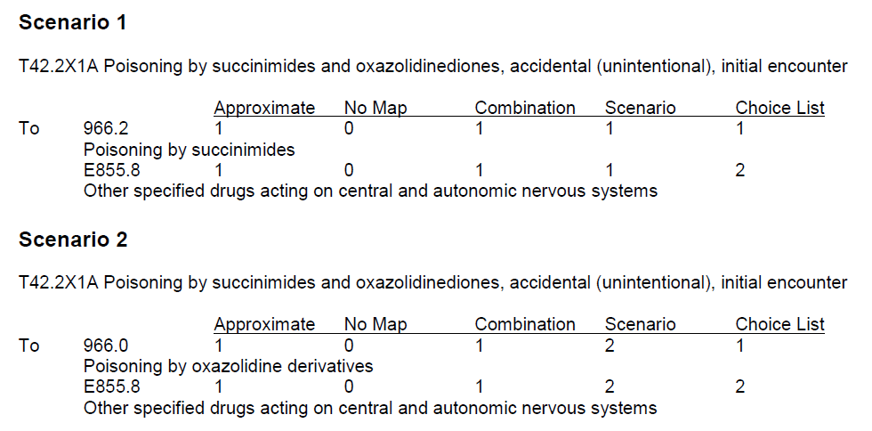

# ICD-9 to ICD-10 Mapping

Performs  mapping to and from ICD-9 to ICD-10.  

## Background 
Diagnosis (CM) and procedure (PCS) codes is based on CMS general equivalence mappings (GEMs).

The purpose of the GEMs is to create a useful, practical, 
code to code translation reference dictionary for both code 
sets, and to offer acceptable translation alternatives wherever 
possible. For each code set, it endeavors to answer this question: 
Taking the complete meaning of a code (defined as: all correctly 
coded conditions or procedures that would be classified to a code 
based on the code title, all associated tabular instructional notes, 
and all index references that refer to a code) as a single unit, what 
are the most appropriate translation(s) to the other code set?

## Mapping
Mappings from specific concepts to more general concepts are possible; 
however, it is not possible to use mappings to add specificity when 
the original information is general.

## Flags
#### 1st Flag -- Approximate
The GEM provides an "approximate" flag (1st Flag).  The approximate flag identifies 
entries where the complete meaning of the source system code and that 
of the target system code are not considered equivalent.  The difference between the 
two systems is typically in level of detail between the codes, and in nearly 
all cases the I-10 code is more detailed than the I-9 code.

The approximate flag is 0 when the complete meaning of the source and the 
target are considered equivalent and the source and target translate only 
to each other in both GEMs files.

When the approximate flag is 1 the complete meaning of the source and the 
target are not considered equivalent.

#### 2nd Flag -- No Map
The "no map" flag distinguishes entries where the source system code has at 
least one translation from entries where the source system code has no 
target system translation. Every effort is made to find an acceptable 
translation in the target system for every code in the source system. 
The no map flag is used only as a last resort, when there are no acceptable 
target system translation alternatives for the source system code.

In the I-10 to I-9 GEM, the “no map” flag is on for a large number of entries. 
In this example, the I-10 codes specify underdosing of a drug. 
I-9 does not contain an equivalent group of codes. Therefore, the I-10 codes 
cannot be linked to I-9 at all. In the I-10 to I-9 GEM the I-10 codes 
are listed without a corresponding I-9 entry, and with the “no map” flag on.

#### 3rd Flag -- Combination
The combination flag distinguishes entries where the source system code has 
a single (meaning “non-combination”) translation alternative(s) from entries 
where the source system has a combination alternative(s).  When the combination 
flag is on, the scenario and choice list fields in a GEM file contain a number. 
They appear last in a GEM file, after the flags. These numbers allow the user to 
collate the combination entries in the GEM. 

T422X1A 9660 10121  
T422X1A 9662 10111  
T422X1A E8558 10112  
T422X1A E8558 10122  

The example above displays the I-10 to I-9 GEMs entry for I-10 diagnosis code _T42.2X1A 
Poisoning by succinimides and oxazolidinediones, accidental (unintentional), 
initial encounter_ as it is depicted in the GEM text file format. Below, the entry 
is repeated with the code descriptions added and attributes labeled. The I-10 
combination code T42.2X1A specifies both the diagnosis and the external cause, 
so it requires a combination entry in the GEM. A combination entry is subdivided 
hierarchically on two levels: 1) By scenario, the number of variations of diagnosis 
combinations included in the source system code, and 2) By choice list, 
the possible target system codes that combined are one valid expression of a 
scenario. 

Each of the two types of drug listed in the I-10 code T42.2X1A is a unique 
I-9 code, so there are two scenarios from which to choose an applied mapping: 
one that specifies poisoning by succinimides and one that specifies poisoning by 
oxazolidinediones.  Because each drug type listed in the I-10 combination code requires 
its own diagnosis code in I-9, each variation of the diagnosis is assigned a 
separate scenario number in the GEM entry.

#### 4th Flag -- Scenario
A source system combination code includes diagnostic conditions or procedures 
that require more than one separate code in the target system to convey the 
equivalent amount of information. A combination code may also describe multiple 
variations of the information in either the code title or the complete meaning 
of the code. Each of these variations has its own number in the "scenario field" 
(the 4th flag).

#### 5th Flag -- Choice List
"Choice lists" (the 5th flag) are the method of organization for the translation 
alternatives in a combination entry. Choice lists organize the distinct 
components of the target system translation in a combination entry 
into pick lists.

## Input file format
51884  
99666  
51881  
V5877  
73025  

## Sample Data
Sample ICD-9 CM and PCS files are included.

## Credit 
Above content adapted from CMS GEM Documentation and User Guides.  Please refer to
https://www.cms.gov/Medicare/Coding/ICD10/Latest_News for additional details.  To learn more 
about the development of the GEM, I recommend reviewing the ICD MS-DRG Conversion Project 
information at https://www.cms.gov/Medicare/Coding/ICD10/ICD-10-MS-DRG-Conversion-Project.

## Resources:
https://www.cms.gov/Medicare/Coding/ICD10/2018-ICD-10-PCS-and-GEMs \
https://www.cms.gov/Medicare/Coding/ICD10/2018-ICD-10-CM-and-GEMs \
https://github.com/Ed-Nonnenmacher/ICD9-ICD10.git \
https://github.com/bhanratt/ICD9CMtoICD10CM.git

